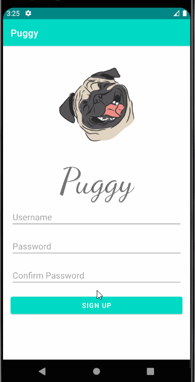
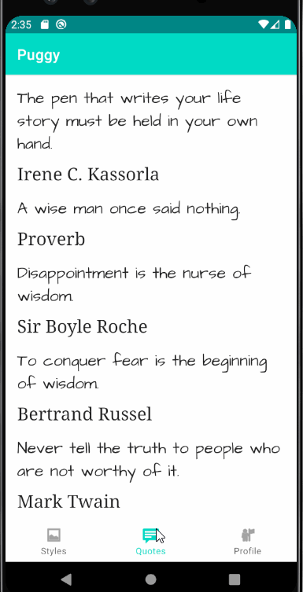

# Original App Design Project - README Template

# Motivational Quotes Application

#### Group 7: Juan Arango, Juan Marquez, Taylor Bean

## Table of Contents

1. [Overview](#Overview)
1. [Product Spec](#Product-Spec)
1. [Wireframes](#Wireframes)
1. [Schema](#schema)

# Week 10 Progress

## Completed Stories

-User Can Log in
-User Can Tap on Menu Selection Bar for the buttons of Quotes, Styles, and Profile

# Week 11 Progress

## Completed Stories

- User Can Logout
- User Can Create an Account
- User Can See Stream of Quotes

# Week 12 Progress

- User can change Quote Styles in Style tab
- User can set Notification Schedule in profile tab
- Profile tab now correctly displays username

## GIFs

### Log In

### Create Account and Logout:

### View Stream of Quotes

### Changing Quote Styles and Scheduling

## Overview

### Description

The application is programmable to send daily quotes or various quites throughout the day depending on the users settings which lead to motivational quotes on the application. Scope involves different quotes, fonts, backgrounds, and profile set up. Database used for saving the quotes.

### App Evaluation

- **Category:** Motivational.
- **Mobile:** It is view-only oriented. Customizable views for each profile.
- **Story:** Allows users to receive a mindful and motivational quote on their preferred time to enhance their day positively.
- **Market:** Anyone that is encourage to receive inspiring quotes will enjoy this application. Ability to customize and schedule quote notifications to the user's likes can make the app engage with further costumers.
- **Habit:** Users can see the main feed with the quotes and on schedule the new quote may appear.
- **Scope:** The application's purpose of providing a daily quote has been expanded to its scope of a customizable schedule of quotes throughout the day, custom design, and open to more features that may allow the user to enjoy and be inspire by our provided quotes even further.

## Product Spec

### 1. User Stories (Required and Optional)

**Required Must-have Stories**

- [x] User can login
- [x] User can Logout
- [x] User can create a new account
- [x] User can view the quote of the day
- [x] User can view a stream of quotes
- [x] User can manage its own schedule for receiving more quotes
- [x] User can choose styles for its feed and quotes
- ...

**Optional Nice-to-have Stories**

- [x] User can like a quote
- [x] User can share a quote with a direct link to the application
- [x] User can comment on the quote
- [ ] User can choose what categories of quotes it would like to see more of
- [ ] User can submit a quote to the team for review
- ...

### 2. Screen Archetypes

- Login Screen
  - User can login here
- Registration Screen
  - User can register here
- Stream Screen
  - User can view quotes in their feed here
- Profile Screen
  - User can adjust schedule time for quotes
  - User can adjust notification settings
- Settings Screen
  - User can adjust style settings for quotes

### 3. Navigation

**Tab Navigation** (Tab to Screen)

- Home Feed
- Profile
- Style

**Flow Navigation** (Screen to Screen)

- Login Screen

  - =>Home

- Registration Screen
  - =>Home
- Styles Screen
  - =>Home, after adjusting your new styles in order to see them applied in your quotes feed now.
- Profile Screen
  - =>None

## Wireframes

### [BONUS] Digital Wireframes & Mockups

### [BONUS] Interactive Prototype

# Schema

## Models

### Quote

| Property           | Type   | Description                                |
| ------------------ | ------ | ------------------------------------------ |
| objectID           | String | The id for the phrase in the database      |
| author             | String | Quote Author                               |
| quoteText          | String | The literal quote text                     |
| likesCount (extra) | int    | Counter for likes of the phrase of the day |

### User

| Property     | Type   | Description                                                                                                                              |
| ------------ | ------ | ---------------------------------------------------------------------------------------------------------------------------------------- |
| userID       | String | The id for each user (important to connect each user with the user matched in the database so that a user does not get repeated phrases) |
| scheduleTime | int    | For the selected preferred time to send a new motivational quote (may be a DateTime type)                                                |
| likesCount   | int    | Number of times user likes the phrase of the day                                                                                         |

### Style (Extra)

| Property        | Type   | Description                                                                                                    |
| --------------- | ------ | -------------------------------------------------------------------------------------------------------------- |
| styleID         | String | The id for the style selected by the user, which will have predetermined font, size, and background selections |
| font            | String | Determines what font is used in the phrases                                                                    |
| size            | int    | Determines the size of the letters of the phrases                                                              |
| backgroundStyle | String | Shall determine what background colors and overall style will appear for the user given its selection          |

### Networking

List of network requests by screen

**Home Feed Screen**

(Read/GET) Query all phrases that shall be displayed in home screen

(Create/POST) Create a new like on a post (extra)

(Delete) Delete existing like (extra)

**Styles**

(Update/PUT) Update selected style for phrases

**Profile Screen**

(Read/GET) Query logged in user object

(Update/PUT) Update scheduled time for phrase

(Update/PUT) Update notifications preference
